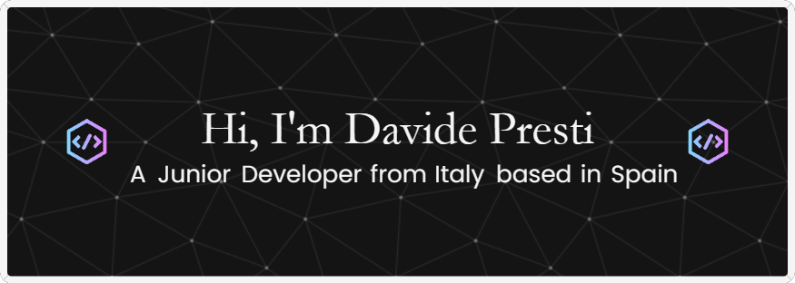

  

  

  

    
    

      <h2>About me:</h2>
      

      
🔭 I’m currently working on <a href="https://github.com/davevad93/rest-countries-django-app">rest-countries-django-app</a>

      
👯 I’m collaborating on <a href="https://github.com/aprendedeceropython">Comunidad Python Aprende desde Cero</a>

      
🌱 I’m currently learning <b>Java, Docker, IT Automation</b>
 
      
💬 Ask me about <b>Python, C#, HTML, CSS</b>
 

<h2 align="center">Languages and Tools:</h2>

      </a>    <a href="https://getbootstrap.com" target="_blank" rel="noreferrer">     

&nbsp;

<!--
**davevad93/davevad93** is a ✨ _special_ ✨ repository because its `README.md` (this file) appears on your GitHub profile.

Here are some ideas to get you started:

- 🔭 I’m currently working on ...
- 🌱 I’m currently learning ...
- 👯 I’m looking to collaborate on ...
- 🤔 I’m looking for help with ...
- 💬 Ask me about ...
- 📫 How to reach me: ...
- 😄 Pronouns: ...
- ⚡ Fun fact: ...
-->
